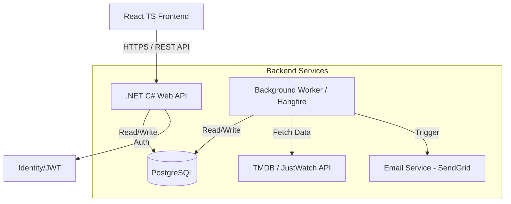

# StreamShift

A service where users input a watchlist of movies that they want to see but don't want to pay rental fees for. StreamShift connects to the TMDB and JustWatch APIs and notifies the user when a movie on their watchlist is on a streaming service they subscribe to.

