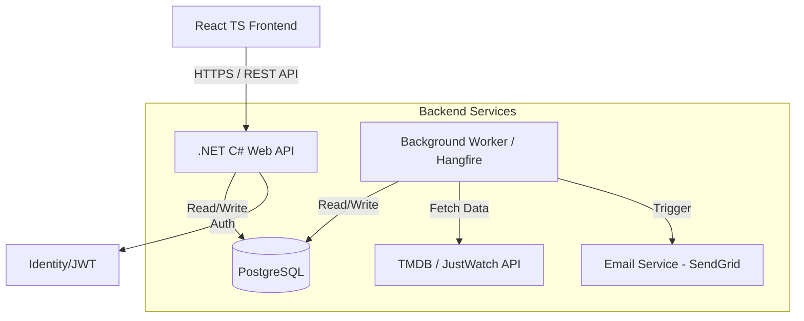

# StreamShift

A service where users input a watchlist of movies that they want to see but don't want to pay rental fees for. StreamShift connects to the TMDB and JustWatch APIs and notifies the user when a movie on their watchlist is on a streaming service they subscribe to.

### Starting the Postgres Database

- Create a `.env` file and place it in the root of the project. Populate this file with values for `POSTGRES_DB`, `POSTGRES_USER`, and `POSTGRES_PASSWORD`.

- In the root of the project, run `docker compose up -d`. The container should now be running and a volume created.